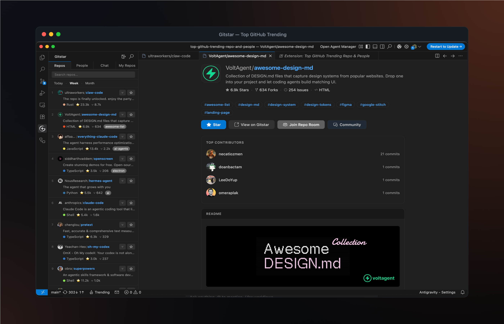
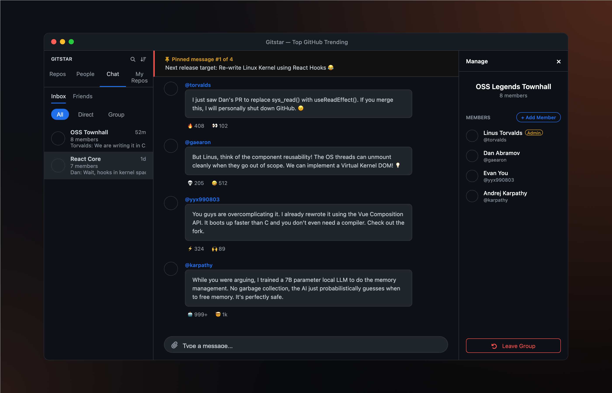
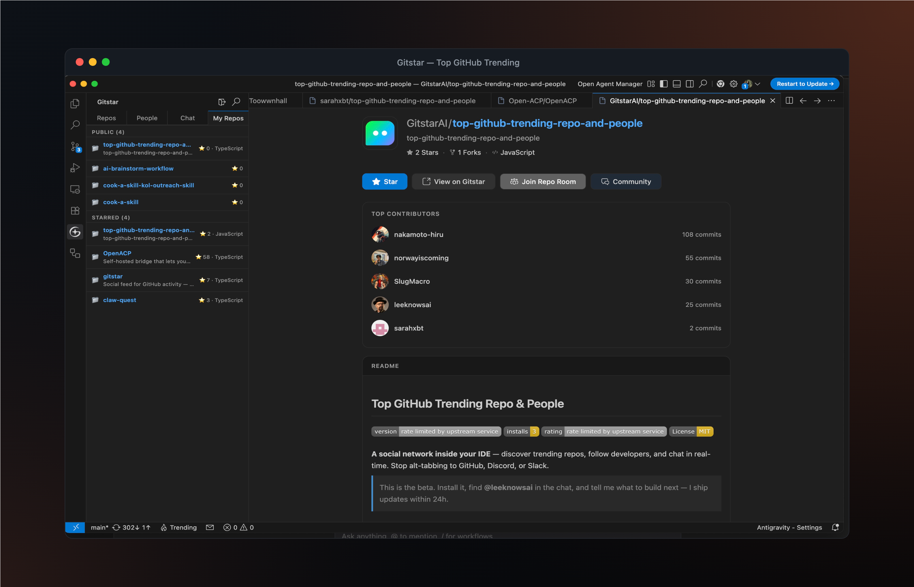

<div align="center">
  
  <br>
  <h3>Trending repos. Native co-working. Never leave your editor.</h3>
</div>

<p align="center">
  <a href="https://marketplace.visualstudio.com/items?itemName=GitchatAI.top-github-trending"></a>
  <a href="https://marketplace.visualstudio.com/items?itemName=GitchatAI.top-github-trending"></a>
  <a href="https://marketplace.visualstudio.com/items?itemName=GitchatAI.top-github-trending"></a>
  <a href="https://opensource.org/licenses/MIT"></a>
</p>

# GitchatAI — Top GitHub Trending Repos & Developer Chat

**A unified social network inside your IDE** — discover trending open-source projects, follow top developers, and chat in real-time. Stop alt-tabbing between GitHub, Discord, and Slack.

> Install it, find **@leeknowsai** in the chat, and tell me what to build next — we ship feature updates within 24 hours.

## Quick Install

Open VS Code / Cursor / Windsurf / Antigravity, press `Ctrl+P` (`Cmd+P` on Mac), paste:

```bash
ext install GitchatAI.top-github-trending
```

Or install from:
- [VS Code Marketplace](https://marketplace.visualstudio.com/items?itemName=GitchatAI.top-github-trending)
- [Open VSX Registry](https://open-vsx.org/extension/GitchatAI/top-github-trending)

---

## Why This Extension?

| Feature | GitchatAI | Other Extensions |
|---------|-------------------|-----------------|
| Trending Repos (5-min refresh) | ✅ | ✅ Basic |
| Trending People + Star Power | ✅ | ❌ |
| Real-time DMs & Group Chat | ✅ | ❌ |
| Personalized "For You" Feed | ✅ | ❌ |
| Actively Maintained | ✅ | ⚠️ Varies (most inactive since 2021-2024) |

---

## Features

### Trending Repositories
Browse what's hot on GitHub right now. Refreshed every 5 minutes. Find the next big open-source breakthrough natively without scrolling endless threads.


### Trending People
Discover top developers shaping the open-source ecosystem, check their Star Power, and get inspired by who's shipping.


### Real-time Developer Chat
The community lives where the code lives. Discuss repositories, start direct messages, and group chat with open-source legends natively inside your editor. 


### My Repos & Personalized Feed
Keep track of your own impact and get a smart "For You" feed of what everyone in your network is building.


---

## Works with
VS Code, Cursor, Windsurf, Antigravity, Void, OpenCode, and any IDE supporting VS Code extensions.

## Getting Started
1. Install via `ext install GitchatAI.top-github-trending`.
2. Click the **Explore** (Gitchat) icon in your activity bar.
3. Sign in securely via GitHub OAuth to unlock the extension (required to prevent API abuse and provide real-time social features).
4. Discover trending repos, follow people, and start your first chat!

## Commands & Shortcuts
Open the command palette (`Cmd+Shift+P` / `Ctrl+Shift+P`):

| Command | Shortcut | Description |
|---------|----------|-------------|
| Trending: Sign In | | Sign in with GitHub |
| Trending: Search | | Search repos & people |
| Trending: Browse Trending Repos | `Cmd+Shift+G T` | Open trending repos |
| Trending: Open Inbox | `Cmd+Shift+G M` | Open your messages |
| Toggle Sidebar | `Cmd+Shift+G G` | Show/hide the Explore sidebar |

## Built With

TypeScript · VS Code Webview API · Socket.IO · Axios · GitHub OAuth Device Flow

## Privacy

This extension requires GitHub OAuth for authentication. See our [Privacy Policy](https://gitchat.sh/privacy).

## Feedback & Issues
Found a bug or have a feature request? Let's build together. [Open an issue](https://github.com/GitchatAI/top-github-trending-repo-and-people/issues).

---

### Frequently Asked Questions (FAQ)

**What is the GitchatAI Top GitHub Trending extension?**
It is a social coding tool for VS Code, Cursor, Windsurf, Antigravity, and other compatible IDEs that allows developers to discover trending repositories, follow other developers, and chat in real-time directly inside their editor.

**Does this extension work with AI editors like Cursor and Windsurf?**
Yes, the extension is fully compatible with modern AI-assisted IDEs including Cursor, Windsurf, Antigravity, and all standard VS Code forks.

**Is an account required to use the extension?**
Yes, a GitHub account is required. To provide a seamless, spam-free social coding experience and prevent API abuse, you must authenticate securely via GitHub OAuth.

**License:** MIT
